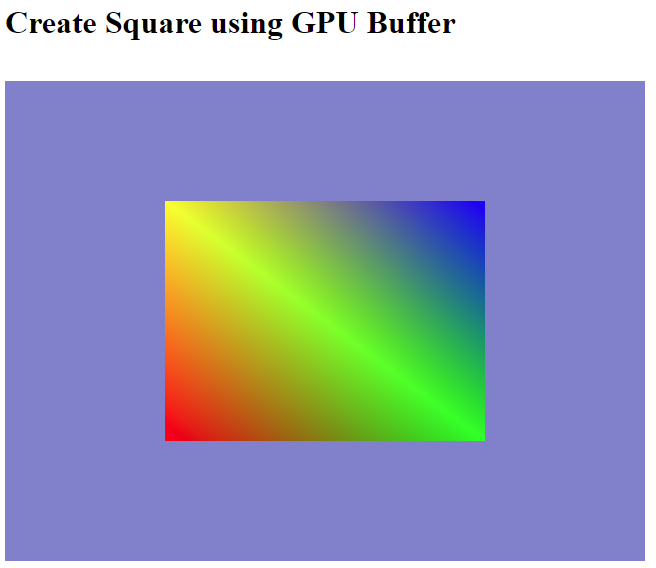

# Step-by-Step WebGPU Graphics Programming (7) 
## Create Square using GPU Buffer 

This is the source code for the 7th part of a series YouTube videos on step-by-step WebGPU graphics programming.

This sample WebGPU app creates a square using GPU buffer. The output from the app is shown in the following image.

